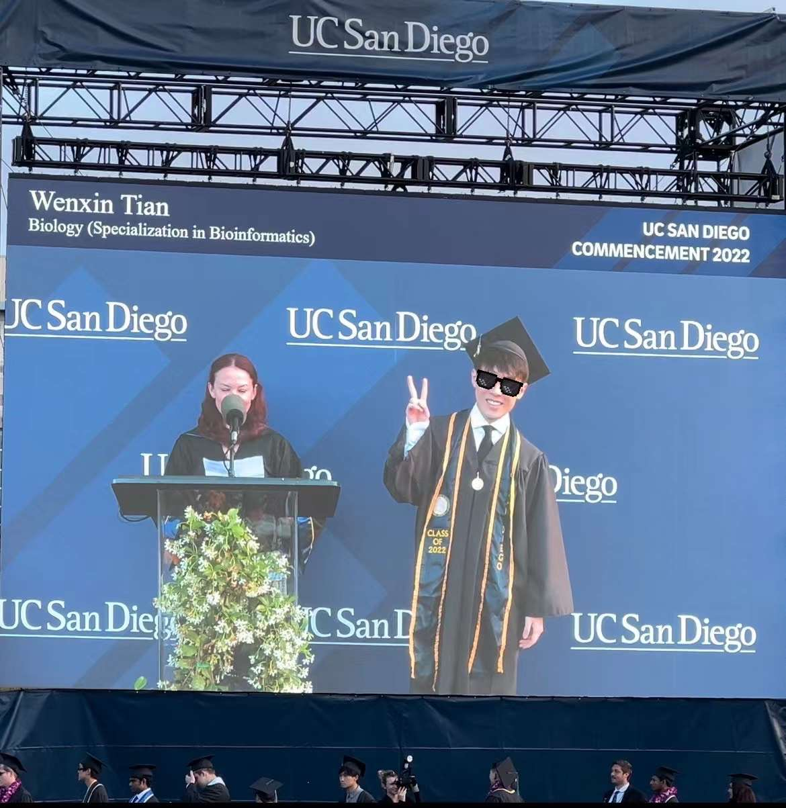
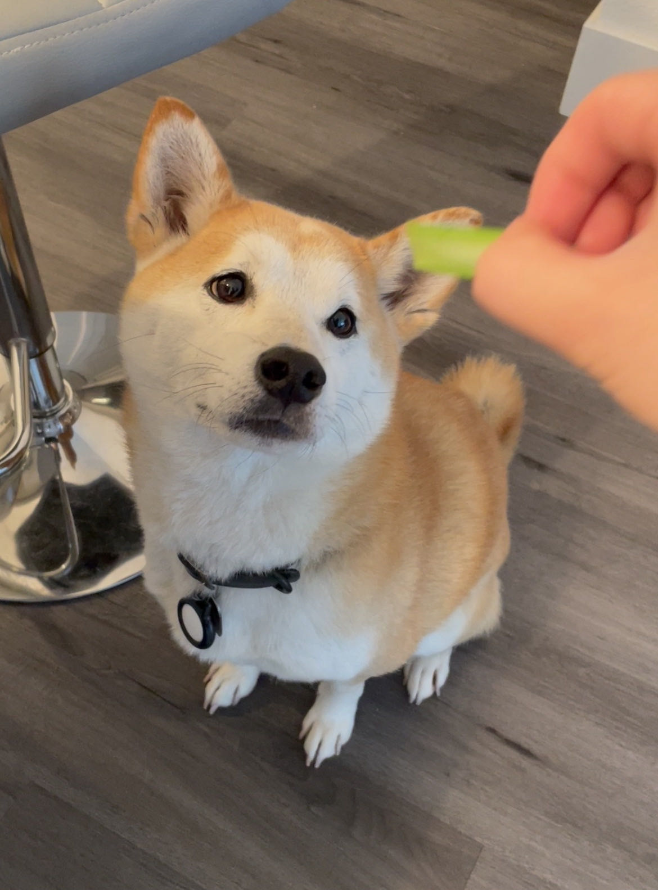

# Hi there! This is me!

# And this is my shiba-inu, Brian!

# About:

Hi there! My name is Will Tian. I recently graduated with a BS in Bioinformatics from UC San Diego and am now in my first semester in the MS in Biostatistics program at Columbia University Mailman School of Public Health. Since both of my
parents work as medical doctors, I grew up with the goal of entering the healthcare industry. But at the
end of high school, I found my passion in computer science and programming. Luckily, thanks to
bioinformatics and biostatistics, I had the option to contribute to medicine and biomedical research by pursuing my
passion.

## Tabset: {.tabset}

### By Product:

this is my first tab

### By Region:

this is my second tab

