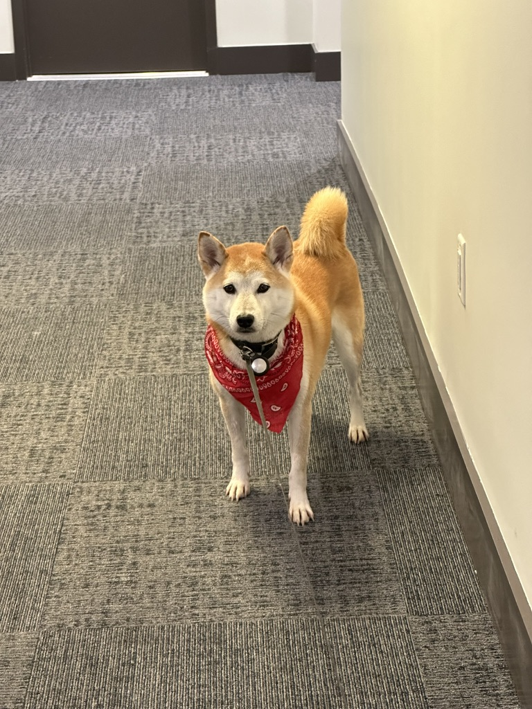

# This is Will's awesome website


## Here's a subsection:

Additional Text....

```{r}
rnorm(10)
```

## Linke to local image:

Here's Brian:



## Links to other websites:

Lets link to useful data science websites:

* [Google](https://www.google.com/)
* [P8105](https://p8105.com/)

Link to page within the site:

* [About Me](about.html)

